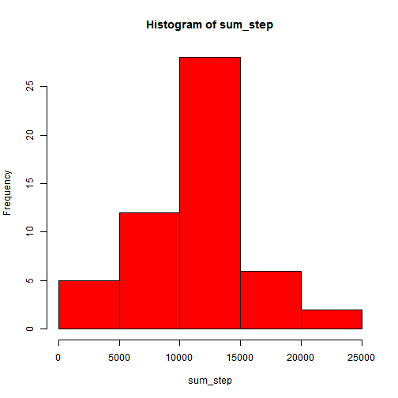
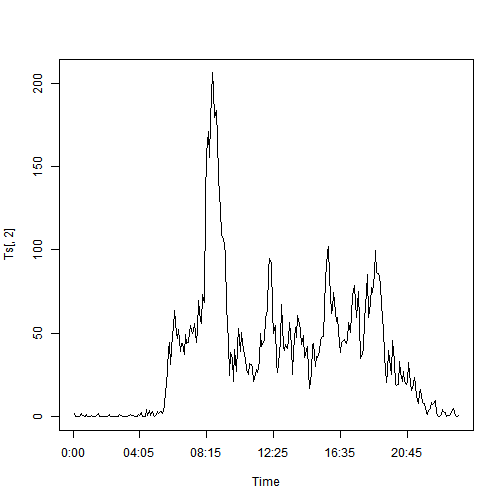
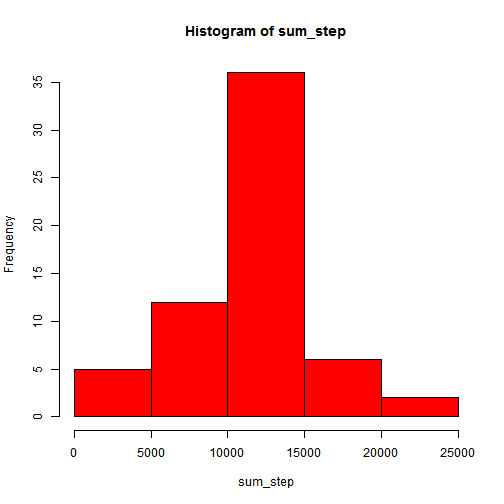
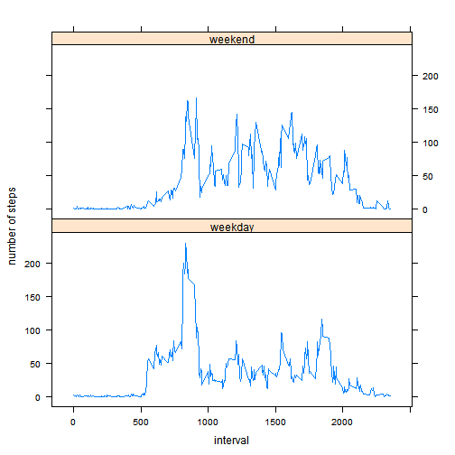

## Loading and preprocessing the data
1. use the `read.csv()` function load the day for my own work director    
2. exclude the Na values.

```r
data<-read.csv("C:/DataScience/R/Coursera/activity.csv",stringsAsFactors= FALSE)
data<-data[complete.cases(data),]
```


## What is mean total number of steps taken per day?
1. Make a histogram of the total number of steps taken each day with the `hist()` function  
2. Calculate and report the **mean** and **median** total number of steps taken per day

```r
k<- split(data$steps,data$date)
sum_step<-sapply(k,sum,na.rm=TRUE)
hist(sum_step,col="red")
```

 

```r
mean(sum_step)
```

```
## [1] 10766
```

```r
median(sum_step)
```

```
## [1] 10765
```


## What is the average daily activity pattern?

1. find the 5-minute interval which contains the maximum number of steps, and display the max value (with `which.max`function and `max()`function)    
2. Make a time series plot (i.e. type = "l") of the 5-minute interval (x-axis) and the average number of steps taken, averaged across all days (y-axis)

```r
Ts<-aggregate(data$steps,by = list(data$interval), mean, na.rm = TRUE, simplify = TRUE)
Ts[which.max( Ts[,2] ),1]
```

```
## [1] 835
```

```r
max( Ts[,2] )
```

```
## [1] 206.2
```

```r
plot.ts(Ts[,2],type ="l",xaxt = 'n')
axis(1, labels = c('0:00', '04:05', '08:15', '12:25', '16:35','20:45'), at = c(0, 50, 100, 150, 200,250))
```

 


## Imputing missing values
1. Calculate and report the total number of rows with NAs    
2. Filling in all of the missing values in the dataset with the mean for that 5-minute interval   
3. Create a new dataset that is equal to the original dataset but with the missing data filled in.    
4. Make a histogram of the total number of steps taken each day and Calculate and report the mean and median total number of steps taken per day.
5. these values **not differ from** the estimates from the first part of the assignment (it beacuse we exclude the Nas at first part rather than make the Nas as 0)

```r
data<-read.csv("C:/DataScience/R/Coursera/activity.csv",stringsAsFactors= FALSE) #reload the data
data2<-data
length(data$steps[is.na(data$steps)])##total number of rows with NAs
```

```
## [1] 2304
```

```r
k<- split(data$steps,data$interval)
for (i in 1:length(k)){
    k[[i]][is.na(k[[i]])]<-Ts[i,2]
}
data2$steps<- unsplit(k,data$interval)##Create a new dataset
head(data2)
```

```
##     steps       date interval
## 1 1.71698 2012-10-01        0
## 2 0.33962 2012-10-01        5
## 3 0.13208 2012-10-01       10
## 4 0.15094 2012-10-01       15
## 5 0.07547 2012-10-01       20
## 6 2.09434 2012-10-01       25
```

```r
k<- split(data2$steps,data2$date)
sum_step<-sapply(k,sum)
hist(sum_step,col="red")
```

 

```r
mean(sum_step)
```

```
## [1] 10766
```

```r
median(sum_step)
```

```
## [1] 10766
```

## Are there differences in activity patterns between weekdays and weekends?

1. Create a new factor variable in the dataset with two levels -- "weekday" and "weekend" indicating whether a given date is a weekday or weekend day.     
2. Make a panel plot containing a time series plot  of the 5-minute interval (x-axis) and the average number of steps taken, averaged across all weekday days or weekend days (y-axis). 

```r
k<-strptime(data$date,"%Y-%m-%d",tz = "GMT")
data2$days<-k$wday
for (i in 1:length(data2$days)){
    if (data2$days[i]==0|data2$days[i]==6) data2$days[i]<- "weekend"
    else data2$days[i]<- "weekday"
}

Ts2<-aggregate(data2$steps,by = list(data2$interval,data2$days), mean, na.rm = TRUE, simplify = TRUE)
library(lattice)
xyplot(Ts2$x~Ts2$Group.1|Ts2$Group.2,data=Ts2,type = "l",layout = c(1, 2),ylab= "number of steps",xlab = "interval")
```

 


